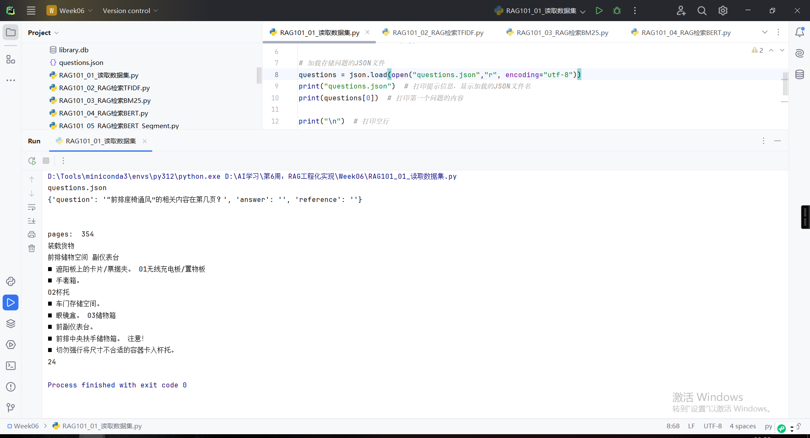
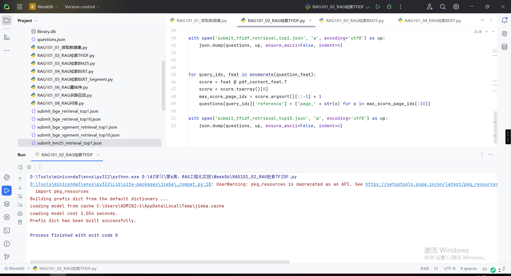
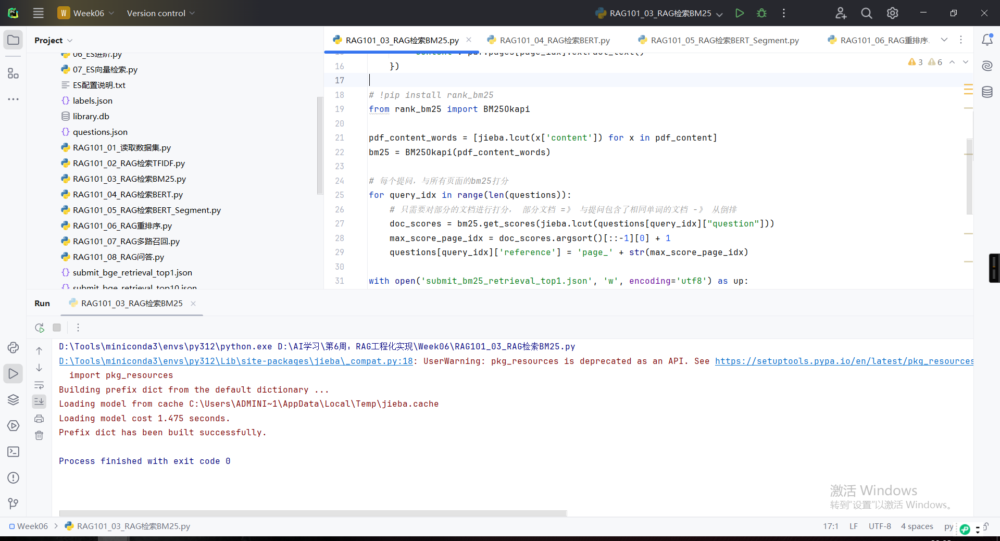
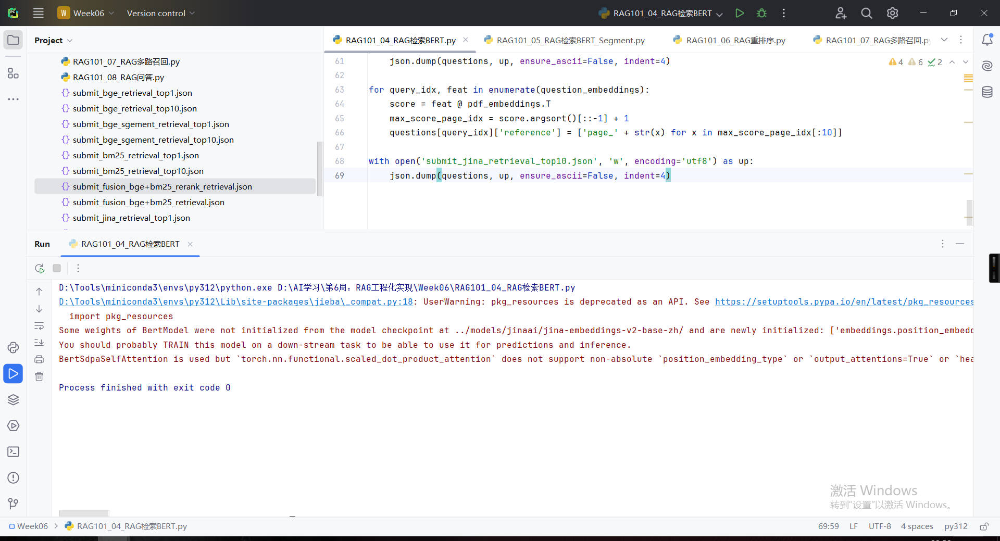
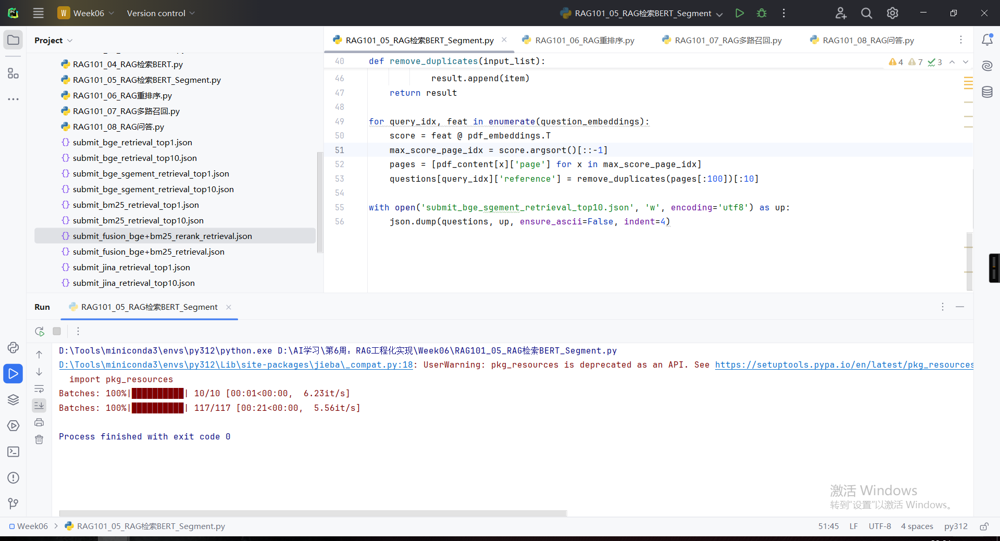
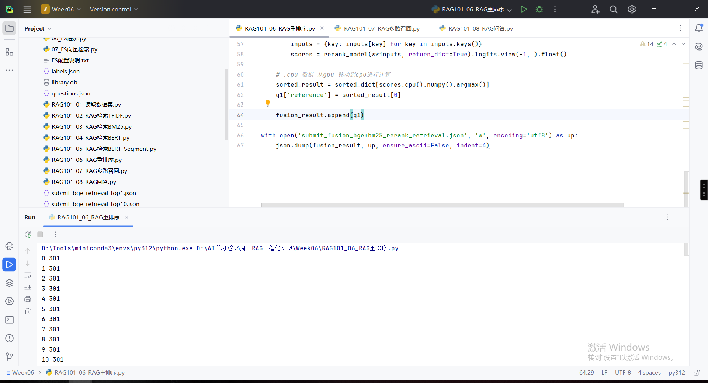
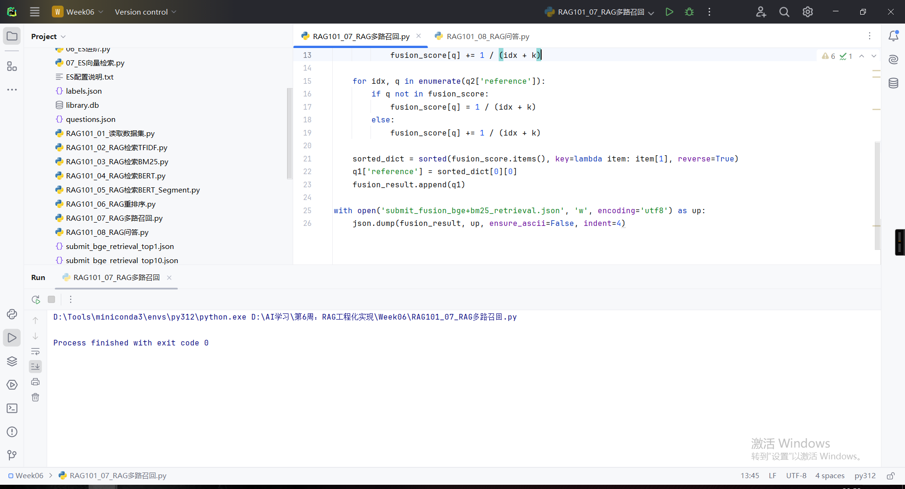

# RAG101_01_读取数据集.py

# RAG101_02_RAG检索TFIDF.py

# RAG101_03_RAG检索BM25.py

# RAG101_04_RAG检索BERT.py

# RAG101_05_RAG检索BERT_Segment.py

# RAG101_06_RAG重排序.py

# RAG101_07_RAG多路召回.py

# RAG101_08_RAG问答.py

